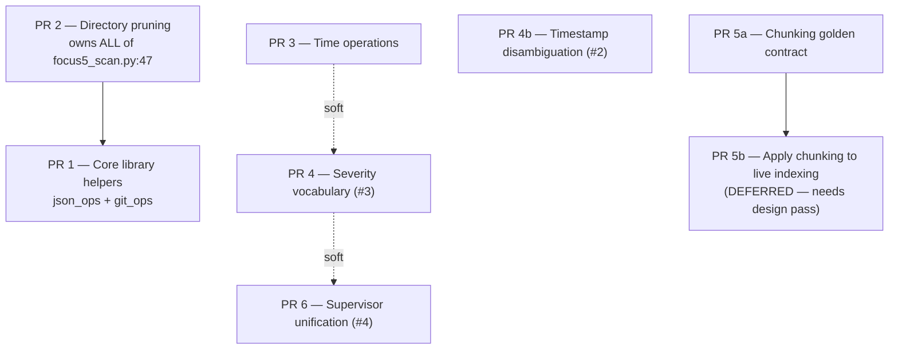

# GH-5 — Subsystem Consolidation

> **Plan provenance.** This doc is the local PDDA capture of the final adjudicated plan posted as
> the last comment on [#5](https://github.com/HiQS-Suite/rebalanceOS/issues/5#issuecomment-5308674363).
> That plan was produced by adjudicating agy's Phase 0/1/2 research (every file:line citation
> independently re-verified — several were wrong, corrected there), then reviewed by Codex over
> **4 relay-xyz rounds**: 6 Blockers + 8 Shoulds surfaced, all verified against source and folded
> in, zero declined. The relay closed at `STATUS: Escalated` (round cap reached), which is the
> honest terminal state — not an approval.

## Status

| What was just completed | What's next |
|---|---|
| Plan adjudicated and frozen (see provenance above). Every citation in the plan re-verified a second time against **this** repo's tree before execution began — the relay reviewed the retiring `Hypercart-Dev-Tools/rebalance-OS` checkout, so the line references needed re-confirming here. All confirmed identical (`focus5_scan.py:47`, `ask_self_scan.py:47`/`:106`, `local_repos.py:32`). | Execute PR1–PR6 on `feat/gh-5-subsystem-consolidation`, one commit per phase. PR 5b is deliberately **not** executed — it needs its own design pass (see Phase 5b). |

## Why

Three independent, non-communicating status/severity vocabularies were found in one running
system while diagnosing dashboard confusion (#2, #3). That was the seed, not the scope: a Phase 0
sweep found the same "reinvent per subsystem" pattern across LLM-JSON parsing, repo-identity
regexes, directory-prune blacklists, timezone helpers, text chunking, and launchd supervision.

## The load-bearing design constraint

`HiQS/` and `utils/3-eyes/` are **standalone packages by design** — HiQS is planned for extraction
to `HiQS-Suite/HiQS`; 3-Eyes runs from its own launchd shim under a limited `PYTHONPATH` and is
explicitly architected to degrade gracefully when the repo venv is absent. Two of agy's candidates
proposed fixing them by importing from `rebalance.lib`, which contradicts the same research's own
justification for keeping their config/DB isolated.

**Adjudicated rule for this whole campaign: duplicate, don't import.** Where a helper also lives
inside a standalone package, the standalone copy stays untouched and equivalence is proven by a
shared golden-fixture test — never by a new cross-package import. This rule is applied in PR1,
PR3, PR5a and PR6.

## Existing issues folded into these phases

| Issue | Phase | Note |
|---|---|---|
| [#3](https://github.com/HiQS-Suite/rebalanceOS/issues/3) severity vocabulary | Phase 4 | Direct fit — the seed case for this whole campaign |
| [#2](https://github.com/HiQS-Suite/rebalanceOS/issues/2) two timestamps read as one | **Phase 4b** | **Correction made 2026-08-16:** the adjudicated plan claimed Phase 4 "addresses #2, #3", but Phase 4's actual scope (severity mapping at the `doctor.py` boundary) does **not** touch #2. #2 is a *presentation* defect in `scripts/pulse_web.py` — the topbar's `System: <clock>` render stamp sits directly above the banner's `Last collector activity <relative>`, two different sources adjacent with overlapping wording. Split into its own phase rather than left falsely covered. |
| [#4](https://github.com/HiQS-Suite/rebalanceOS/issues/4) git-pulse dead since 2026-08-11 | Phase 6 | Partial by design. #4's own follow-up comment established the code was never the bug (`set -euo pipefail` + `self_heal_sync_repo()` already handle it) — the sole root cause was launchd unloading the job. Phase 6 addresses the *supervision* half (nothing watches loaded-state); the "reload the job on that machine" half is an ops action this repo's suite cannot perform. Phase 6 also picks up #4's ready **protective** regression test guarding the existing early-abort behavior. |
| [#1](https://github.com/HiQS-Suite/rebalanceOS/issues/1) sustained-activity auto-promotion | **not folded in** | Unrelated feature work (watchlist promotion logic), not a reinvented-concept consolidation. Bundling it would violate this issue's own "do not bundle unrelated consolidations" rule. |

## Phases

Dependency graph (hard edges only): **PR2 → PR1**, **PR5a → PR5b**. Everything else is
preference/merge-conflict avoidance, not a block.

### Phase 2 (runs first) — Directory pruning

`rebalance.lib.git_ops` becomes sole owner of `DEFAULT_PRUNE_DIRS`, **moved** (not copied) from
`ask_self_scan.py:47`. This PR owns the **entire** `focus5_scan.py:47` import rewrite — that one
line supplies both `_PRUNE_DIRS` (this phase) and `derive_repo_full_name` (Phase 1), so splitting
it guarantees a conflict and blocks Phase 1's stated goal.

`ask_self_scan.py` / `focus5_scan.py` keep current behavior, repointed only.
`local_repos.py` and `experimental/git-pulse/discover-repos.py` **intentionally widen** from
dot-directory-only skipping to the full blacklist — a real, deliberate behavior change, called out
rather than silently bundled.

### Phase 1 — Core library helpers

- `json_ops.parse_llm_json` / `strip_code_fences` land in `src/rebalance/lib/json_ops.py`.
  `utils/3-eyes/three_eyes/classify.py`'s own `_first_json_object`/`_parse_model_json`
  **stay untouched** (standalone-isolation rule) — equivalence proven by golden fixture.
  Only `scripts/health_issue_reporter.py` is rewired.
- `health_issue_reporter.py`'s `_strip_code_fence` is **dead code** (defined, never called) —
  delete, don't migrate. The real model-output parses are its two `json.loads()` calls on model
  text; the one parsing the Gemini HTTP response *envelope* must stay untouched.
- `git_ops.parse_github_remote_url` consolidates `local_repos.py:32`'s `_FULL_NAME_RE` and
  `ask_self_scan.py:58`'s `_REMOTE_RE` **internals only**.
- `querier.py` **excluded** — its defensive access is on already-parsed JSON, a different problem
  shape that doesn't share the bug class being fixed.

### Phase 3 — Time operations

Migrate the source files importing `rebalance.tz_utils` onto `rebalance.lib.time_ops`; retire
`dashboard.py:_ago`. `tests/test_tz_utils.py` is **not** touched — its job is proving the
deprecated re-export shim still works, which stays meaningful until a separately announced removal.

`experimental/git-pulse/health-check.py`'s `parse_utc` is **out of scope**: it is unreachable from
`rebalance.lib` under its own `sys.path`, *and* it treats naive timestamps as host-local while
`time_ops.parse_utc_iso` treats them as already-UTC — swapping would silently shift timestamps by
the host's UTC offset. Stays script-local, per the duplicate-don't-couple rule.

### Phase 4 — Severity vocabulary alignment (#2, #3)

At `doctor.py`'s `_check_pulse_collectors()` **only**: map `pulse_health` state → canonical
`Check.severity` before it reaches user-facing `detail` text, and fix the confirmed inversion
where a **healthy** (`ALIVE`) collector currently reports `severity=WARNING`.

`pulse_health.py` itself stays untouched — its 5-state model has other consumers and its own tests.
`index_ops._derive_signal_health()` is **excluded**: its `ok`/`warn`/`degraded` values are a
separate, already-tested, already-consumed contract, unrelated to the #2/#3 confusion.

### Phase 4b — Timestamp disambiguation (#2)

Separate from Phase 4 (see the issue-mapping table above — the adjudicated plan wrongly folded
this into Phase 4's severity work). Scope is `scripts/pulse_web.py` only: the health banner's lead
row must stop using the word "collector" for what is actually *general ingestion* activity, so it
no longer reads as a second, contradictory reading of the same thing the per-device pulse-collector
checks report. Ready acceptance test already posted on #2.

No `doctor.py` changes, no severity changes — those are Phase 4's.

### Phase 5a — Chunking golden contract

Promote `HiQS/hiqs/chunking.py:split_oversized` (with `_pack()`, 600-char cap) to
`rebalance.lib.text_ops`, with a golden test proving byte-identical output. **No wiring into any
write path.** HiQS keeps its own copy.

### Phase 5b — Apply chunking to live indexing (DEFERRED, not executed here)

Wiring `split_oversized` into `note_ingester.py`/`semantic_index.py` breaks an existing identity
contract: one `chunks` row per `md_parser` chunk, with each semantic document keyed 1:1 off that
row's id. Splitting a chunk with no stable child-key scheme breaks that mapping, and no stale-child
deletion behavior is defined for re-indexing. Needs its own design pass
(`{row_id}#{part_index}` keys, stale-child deletion, keyword/link-semantics regression) before any
code lands.

### Phase 6 — Supervisor unification (#4)

`doctor.py` consumes 3-Eyes's `health.scan()` read model by **reusing the existing adapter**
`web.py:_three_eyes_health_scan()` (already tested via `tests/test_focus5_three_eyes.py`) rather
than designing a new consumption path.

Two corrections that are easy to get wrong:
1. That adapter has **no exception handling of its own** — the try/except lives in a *different*
   caller. Doctor must define and test its `Check` for three cases: inactive sentinel (omit),
   import/scan exception (`WARN`, never silently healthy), structured probe-unavailable
   (`WARN`, surfacing `probe_error`).
2. `launchd_crash_state.json` and doctor's crash-loop detection are **retained**. 3-Eyes's
   `scan()` is a single-snapshot read with no persisted multi-poll history — deprecating doctor's
   state file would silently delete a diagnostic capability 3-Eyes does not replace.

3-Eyes's package-relative `ROOT.parent.parent` resolver stays as-is — no `rebalance.paths` import.

## QA gate (per #5's standing policy)

Every phase ships a regression test that **fails pre-change and passes post-change** — not generic
coverage.

| Phase | Gate |
|---|---|
| 2 | Pruned non-hidden dir (`node_modules/`) and a valid nested checkout survive the walk, at each consuming call site; explicit test that the widened pruning is intended, not accidental |
| 1 | `tests/test_json_ops.py` (new): fenced JSON, trailing prose, non-object JSON, malformed JSON, plus golden-fixture equivalence against `classify.py`'s untouched copy |
| 3 | Consolidated time behavior covered; `tests/test_tz_utils.py` left green and untouched |
| 4 | Reuse the ready acceptance test posted on #3 (`test_detail_leads_with_canonical_severity_not_raw_pulse_state`) |
| 4b | Reuse the ready acceptance test posted on #2 (`test_activity_label_does_not_share_wording_with_a_pulse_collector_pill`) |
| 5a | Golden-file test: promoted `split_oversized` byte-identical to HiQS's original |
| 6 | Four distinct doctor `Check` outcomes (inactive / import-exception / scan-exception / structured-probe-unavailable) + proof crash-loop detection still works unchanged |

## Explicitly out of scope

Repo consolidation / HiQS extraction timing, the Swift client, and 3-Eyes's Ollama egress
isolation — all unchanged from agy's Phase 2 scoping.
